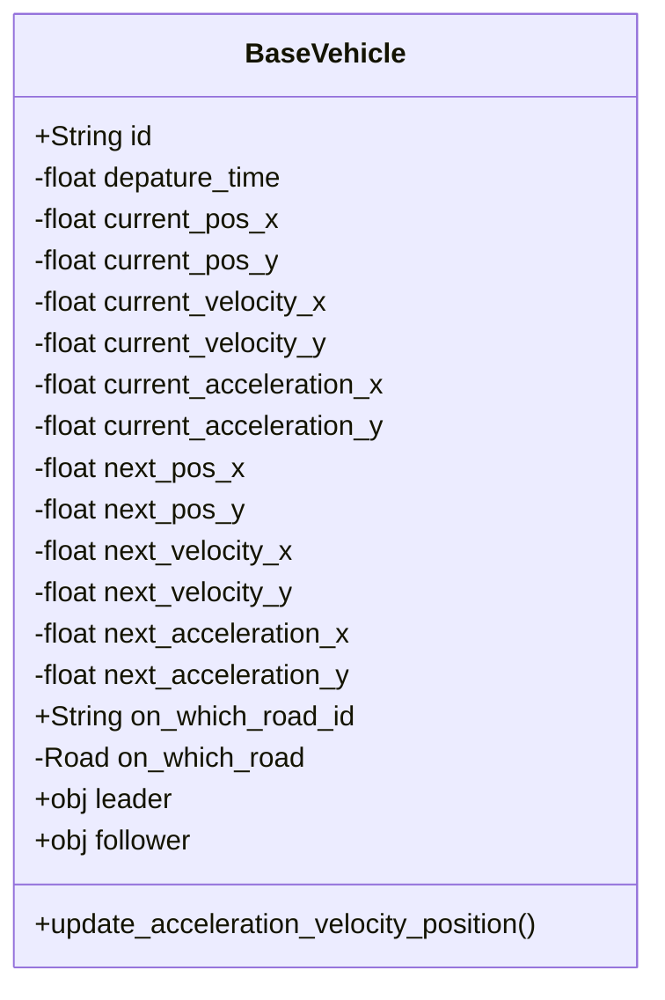
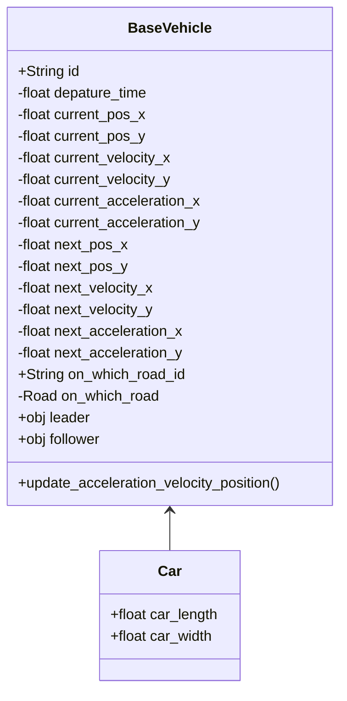
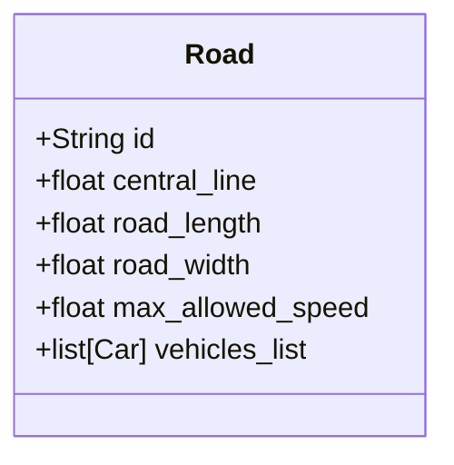
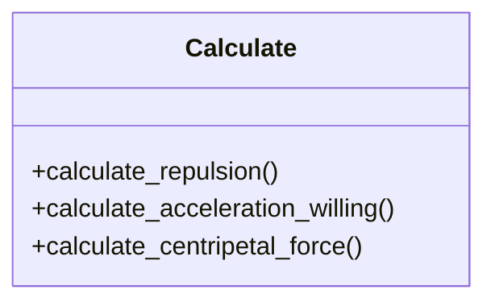

# class
## BaseVehicle

`BaseVehicle` 是车辆的基类，包含所有车辆共有的方法属性。不同的车辆均继承于这个类。

## Car

## BaseRoad

`Road`包含该路段的相关信息。

## RampRoad

`RampRoad`继承自`BaseRoad`类，除了该路段的基本属性方法外，还包括匝道部分。

## Calculate

# files

